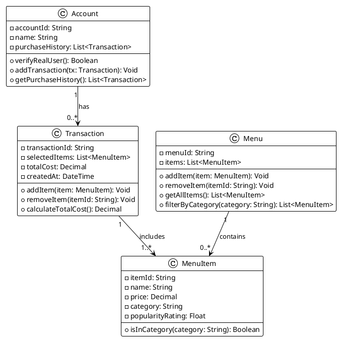

# ByteBites App - UML Class Diagram

## PlantUML Diagram



## Text-Based UML Diagram

```
┌─────────────────────────────────────┐
│            Account                  │
├─────────────────────────────────────┤
│ - accountId: String                 │
│ - name: String                      │
│ - purchaseHistory: List<Trans>      │
├─────────────────────────────────────┤
│ + verifyRealUser(): Boolean         │
│ + addTransaction(tx): Void          │
│ + getPurchaseHistory(): List        │
└─────┬───────────────────────────────┘
      │ has 1..0..*
      │
      └─────────────┐
                    ▼
┌─────────────────────────────────────┐
│         Transaction                 │
├─────────────────────────────────────┤
│ - transactionId: String             │
│ - selectedItems: List<MenuItem>     │
│ - totalCost: Decimal                │
│ - createdAt: DateTime               │
├─────────────────────────────────────┤
│ + addItem(item): Void               │
│ + removeItem(itemId): Void          │
│ + calculateTotalCost(): Decimal     │
└─────┬───────────────────────────────┘
      │ includes 1..1..*
      │
      └─────────────┐
                    ▼
┌─────────────────────────────────────┐
│           MenuItem                  │
├─────────────────────────────────────┤
│ - itemId: String                    │
│ - name: String                      │
│ - price: Decimal                    │
│ - category: String                  │
│ - popularityRating: Float           │
├─────────────────────────────────────┤
│ + isInCategory(cat): Boolean        │
└─────────────────────────────────────┘
      ▲
      │ contained by
      │ 1..0..*
      │
┌─────┴───────────────────────────────┐
│            Menu                     │
├─────────────────────────────────────┤
│ - menuId: String                    │
│ - items: List<MenuItem>             │
├─────────────────────────────────────┤
│ + addItem(item): Void               │
│ + removeItem(itemId): Void          │
│ + getAllItems(): List<MenuItem>     │
│ + filterByCategory(cat): List       │
└─────────────────────────────────────┘
```

## Relationships & Multiplicity

| Relationship | Source | Target | Multiplicity | Role |
|---|---|---|---|---|
| has | Account | Transaction | 1 → 0..* | Customers can have zero or more past transactions |
| contains | Menu | MenuItem | 1 → 0..* | Menu holds zero or more food items |
| includes | Transaction | MenuItem | 1 → 1..* | Each transaction must include at least one item |

## Key Design Decisions

1. **Account**: Maintains user identity and purchase history for verification
2. **MenuItem**: Represents individual food items with pricing and popularity metrics
3. **Menu**: Acts as a repository/collection manager for all MenuItems with filtering capabilities
4. **Transaction**: Aggregates selected items and computes order totals

---
*Generated for ByteBites Smart Food Ordering App*
